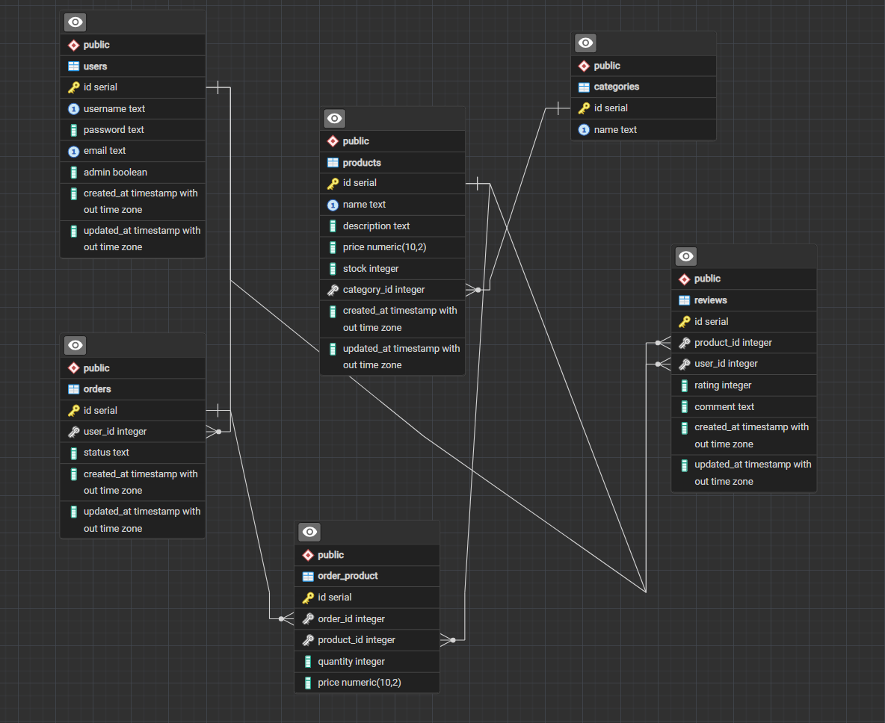

# Módulo 7 Hito 3 Desarrollo Backend - Marketplace de Tecnología y Software “TecnoSoftware”

## Presentación del Desafío

##  

## Descripción del PY ⌨️

El tercer hito consiste en el desarrollo backend del proyecto, en donde vamos a:

● Crear un nuevo proyecto npm.
● Instalar las dependencias necesarias.
● Crear las diferentes rutas de acuerdo con el schema definido.
● Levantar la API REST capaz de gestionar los datos de la base de datos PostgreSQL.
● Implementar la autenticación y autorización de usuarios con JWT.
● Usar el paquete supertest para hacerle pruebas a diferentes rutas de la API REST.
● Utiliza la extensión Thunder Client o la aplicación Postman para hacer las pruebas de las diferentes rutas de la API REST.
● Se divide el servidor en varios módulos para desarrollar la API REST para tener un desarrollo ordenado.

Pre-requisitos para ejecutar el PY.

En la consola bash:

1. Intalar Node Js: https://nodejs.org/en/download/package-manager
2. Ejecutar npm i
3. Subir el servidor, ejecutando: npm run dev
4. Abrir en el navegador la url respectiva.

## Requerimientos entregados:

1. Se creó un nuevo proyecto de npm y se instalaron todas las dependencias necesarias.
2. Utilizamos el paquete pg para gestionar la comunicación con la base de datos PostgreSQL
3. Implementamos la autenticación y autorización de usuarios con JWT.
4. Hicimos uso de los hooks para un desarrollo ágil y reactivo.
5. Utilizamos el paquete CORS para permitir las consultas de orígenes cruzados Context API para el manejo del estado global.
6. Utilozamos middlewares para validar las credenciales o token en cabeceras en las rutas que aplique.
7. Realizamos test de por lo menos 4 rutas de la API REST, comprobandolos códigos de estados de diferentes escenarios

En cosntrucción: menú Carrito, Mi Perfil y ajustes generales.

## Modelo Entidad Relación de la BDD PostgreSql:

## Documentación de la API:

La API de TecnoSoftware es una API RESTful que se utiliza para acceder a la base de datos de los emprendedores de Tecnología y Softawre, consulta información de pedidos, guardar sus dispositivos tecnológicos
y de software favoritos en su cuenta.

● **Autenticación:
La API de TecnoSoftware utiliza tokens de API para autenticar los puntos de conexión protegidos. Puedes generar un token de forma gratuita.
La autenticación en la API se realiza a través de la autenticación del portador. Al realizar una solicitud a un punto de conexión, debe enviar el token en el encabezado Authorization.
Mantenga seguro su token de API. No compartas tu token en áreas de acceso público, como el código del lado del cliente, repositorios de código abierto, etc.
● #URL Base:
La URL base de todos los puntos de conexión de la API de TecnoSoftware es http://localhost:3000
Por ejemplo, para obtener todos los productos a través de la API, la URL completa es una solicitud GET a http://localhost:3000
● #Respuestas:
Todas las respuestas devueltas por la API de TecnoSoftware siguen la especificación JSON:API. Lea la referencia de los puntos de conexión de la API para ver ejemplos de respuestas exitosas.
● #Errores:
La API TecnoSoftware utiliza códigos de estado HTTP comunes para indicar si una solicitud se ha realizado correctamente o si no un error. Los códigos de estado en el rango 2xx indican una respuesta correcta.
Los códigos de estado en el rango 4xx indican Errores causados por su solicitud, como parámetros obligatorios no enviados. Los códigos de estado en el 5xx significan que algo salió mal con la aplicación TecnoSoftware.
Lea la referencia de puntos de conexión de la API para ver ejemplos de respuestas correctas..
● #HTTP Códigos de Estado:
Estos son los códigos de estado HTTP comunes utilizados por la API de TecnoSoftware:
200 (OK): Su solicitud se ha realizado correctamente.
201 (Creado): Su solicitud se ha realizado correctamente y se ha creado un nuevo recurso para su cuenta.
204 (Sin contenido): la solicitud se ha realizado correctamente y no se devuelve ningún contenido en el cuerpo de la respuesta.
401 (no autorizado): su solicitud no se realizó correctamente porque no está autenticado. Por lo general, esto significa que no proporcionó su API o proporcionó un token no válido.
404 (no encontrado): su solicitud no se realizó correctamente porque intentó acceder a un recurso que no existe.
422 (entidad no procesable): la solicitud no se realizó correctamente porque no envió los parámetros necesarios para el punto de conexión.
429 (Demasiadas solicitudes): tu solicitud no se ha realizado correctamente porque has accedido a la API de Airport Gap demasiadas veces en un corto periodo de tiempo.
Consulte la sección Limitación de velocidad para obtener más información.
● #Limitación de Velocidad:
Puede realizar hasta 100 solicitudes por minuto a cualquier punto de conexión. Cualquier solicitud que exceda el límite de tasa recibirá una respuesta 429 Demasiadas solicitudes.
Las solicitudes están asociadas a su dirección IP y se restablecerán cada minuto.

● #Referencia de endpoints de API
Falta colocar ejemplos, descripción y pantalla de resultado.

##  

## Tecnologías Usadas 🛠️

- **Backend:** Node.js, Express.js, JS. 🧑‍💻
- **Frontend:** HTML, CSS, Bootstrap, Axios. 📚
- **Almacenamiento:** Archivos JSON. 🫙
- **BDD:** PostgreSQL

 

---

 

## Autores 👨‍💻

**Luis Fernando Sanchez F. - Daniel Hernández - Desarrolladores Fullstack G60⚡**

Sígueme en mis redes sociales: 
 
